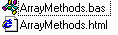



## Library of Array Routines

### Description

I use arrays all the time, so I thought I'd put the functions I commonly use together into a library. Easy to read code. Routines include:

- ArrayCopy(List, ListToCopyFrom, [StartAt], [Length])

 - ArrayAppend(List, Item)

 - ArrayRemove(List, Index)

 - ArrayInsert(List, Index, Item)

 - ArrayConcatenate(List, ListToCopyFrom)

 - ArrayTrim(List, [TrimFromBeginning], [TrimFromEnd])

 - ArraySplice(List, StartAt, Length, [ListToCopy])

 - ArrayToString(List, [Separator])

Clean code with lots of comments in reusable module. Also includes an extensive reference in HTML. Tested with VB6, but should be compatible with all modern versions and VBScript (with minor modifications).

Please vote for this code if you like it.
 
### More Info
 

             |
---                |---
**Submitted On**   |2000-06-01 13:45:06
**By**             |[James Vincent Carnicelli](https://github.com/Planet-Source-Code/PSCIndex/blob/master/ByAuthor/james-vincent-carnicelli.md)
**Level**          |Intermediate
**User Rating**    |4.8 (82 globes from 17 users)
**Compatibility**  |VB 3\.0, VB 4\.0 \(16\-bit\), VB 4\.0 \(32\-bit\), VB 5\.0, VB 6\.0, VB Script, ASP \(Active Server Pages\) 
**Category**       |[Data Structures](https://github.com/Planet-Source-Code/PSCIndex/blob/master/ByCategory/data-structures__1-33.md)
**World**          |[Visual Basic](https://github.com/Planet-Source-Code/PSCIndex/blob/master/ByWorld/visual-basic.md)
**Archive File**   |[CODE\_UPLOAD6311612000\.zip](https://github.com/Planet-Source-Code/james-vincent-carnicelli-library-of-array-routines__1-8502/archive/master.zip)

